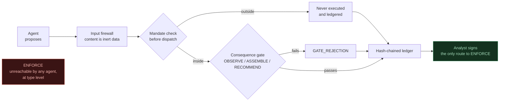

# Trust & Safety Sentry

[](https://github.com/MohdSaifHussain/ts-sentry/actions/workflows/ci.yml)
[](pyproject.toml)
[](LICENSE)
[](pyproject.toml)
[](https://github.com/MohdSaifHussain/ts-sentry/releases)

**A governed agentic workbench for Trust & Safety scaled-abuse analysis.**

Enterprise detection systems find the signal. This workbench eliminates the
manual toil between signal and decision. Every step is auditable, and every
enforcement decision is human.

It is explicitly **not** a detection platform, **not** a moderation system, and
**not** a replacement for enterprise tooling. It models the analyst workflow
downstream of detection: triage, investigation, evidence assembly, enforcement
rationale drafting, prompt quality assurance, and impact measurement.

Four narrow agents do bounded cognitive work under a deterministic control
layer, supervised by one human who holds sole enforcement authority.

## The idea in one diagram

> Detective controls assume the harmful action can occur and race to catch it.
> **Preventive controls remove the action from the action space.**



An agent cannot exceed its mandate because the orchestrator will not dispatch
any action outside it. Two more diagrams, the fleet topology and the session
dataflow, are in [docs/diagrams.md](docs/diagrams.md).

## Start here

- **[QUICKSTART.md](QUICKSTART.md)** gets you from clone to a measurement report.
  Offline after install.
- **[examples/](examples/)** has eight complete runs with their full artifacts,
  including three where the governance layer refuses something. Start with
  [`05-overclaim-refused`](examples/05-overclaim-refused/) if you only read one.
- **[docs/USER_GUIDE.md](docs/USER_GUIDE.md)** is the per-verb reference.
- **[ARCHITECTURE.md](ARCHITECTURE.md)** is the design authority.
- **[docs/DECISIONS.md](docs/DECISIONS.md)** is what was chosen, what was not,
  and why, with citations. It includes the choices made by default with no
  rationale, listed as such.
- **[docs/decisions/](docs/decisions/)** is the per-phase build log, eight
  STEP files each with an Outcome section recording what shipped, what deviated,
  and what was left unmet.

## Install

```bash
python -m venv .venv
.venv/Scripts/activate      # Windows;  source .venv/bin/activate elsewhere
pip install -e ".[dev]"
```

Requires Python 3.12+. **The install step needs network access** because
`analystkit`, the data-quality gate dependency, is pinned to a git revision and
is not on PyPI. Everything after install runs offline.

For a reproducible environment rather than a fast one, see
[QUICKSTART.md](QUICKSTART.md#two-install-paths).

## The CLI

Eight verbs. Every one is offline by default and costs nothing to run.

| Verb | What it does |
|---|---|
| `build-dataset` | Builds the seeded synthetic platform plus sealed ground truth |
| `run-session --agent triage` | Ranks the flagged-entity queue with score decomposition |
| `run-session --agent evidence` | Investigates one case through analyst-approved pivots |
| `run-session --agent memo` | Drafts an Article 17 style enforcement memo from a pack |
| `sign-memo` | The human signature path; the only route to a final memo |
| `eval-prompts` | Evaluates a prompt candidate and gates its activation |
| `report` | The measurement report: VVR with a 95% CI, plus workflow metrics |
| `verify-ledger` | Recomputes a hash chain and reports the first broken link |
| `fetch-policies` | Rebuilds the hashed policy corpus (the only verb that uses network) |

Full flags, artifacts and behaviour per verb: **[docs/USER_GUIDE.md](docs/USER_GUIDE.md)**.

### Exit codes

Allocated across the whole CLI, so no number means two things.

| Code | Meaning |
|---|---|
| `0` | Success |
| `2` | Data-quality gate failed (`build-dataset` only) |
| `3` | Sealed-label leakage check failed |
| `4` | Broken ledger chain |
| `5` | Input error, including any malformed invocation |
| `6` | Chain intact but the head does not match the expected anchor |
| `7` | A prompt candidate was refused activation by the regression gate |

`7` rather than `5` for a regression refusal is deliberate: a refusal is a
governance outcome, not a broken call, and it must be distinguishable from a
mistyped `--candidate`.

## It runs offline and costs nothing

The deterministic stub adapter is the default and the CI path. A run with no
environment configured, no credential, and without the optional vendor package
installed is a complete, valid session.

Live mode requires the intent expressed **twice**: `--llm-mode live` *and*
`TS_SENTRY_LLM_MODE=live` in the environment, plus `ANTHROPIC_API_KEY`, whose
value this repository never reads. It only checks the variable exists and lets
the vendor client read it. A shell alias or a stray argument cannot start
spending money.

The full test suite has been run with `socket.connect`,
`socket.create_connection` and `socket.connect_ex` patched to raise: zero
network attempts.

## What is actually verified

Every number here comes from a run on this machine, not from an earlier phase's
notes.

| | |
|---|---|
| Tests | 1,228 passing |
| Coverage | 93.16% against a 90% floor enforced in CI |
| Types | `mypy --strict` clean on 164 files |
| Lint and format | `ruff` clean |
| Example ledgers | All seven verify, and match their stored anchors |

## Honest Limits

Mandatory and carried forward, per the standing rule. The full standing set is
[ARCHITECTURE.md Section 12](ARCHITECTURE.md#12-honest-limits-standing-section-carried-into-readme);
these are the ones a reader should have before anything else.

- **Synthetic data only.** No claim of real-platform efficacy. The one exception
  is [`examples/08-firewall-real-comments`](examples/08-firewall-real-comments/),
  which pushes 1,956 real YouTube comments through the input firewall and states
  exactly what that does and does not show.
- **Every agent's competence is untested.** Every model output in this
  repository was produced by a deterministic stub that cannot be persuaded and
  cannot reason. What is tested is the *pipeline*: that outputs are checked
  rather than trusted, that refusals are recorded with countable reasons, and
  that every step is traceable. None of it is evidence about how a model
  behaves.
- **This system does not detect abuse.** The flagged-entity queue is a
  deterministic stub standing in for the enterprise detector upstream. Its
  severity signal has no measured precision or recall and must never be read as
  detection performance.
- **Workflow uplift figures are modelled estimates, not user studies.** There is
  no published per-case review-time benchmark to cite, so the model reports a
  break-even rather than "minutes saved". `MinutesResult` has no `minutes_saved`
  attribute, and that is enforced by test.
- **The VVR estimand is narrow**, and narrower still on this corpus: 18
  violative views out of 18,780, all from two threat classes. The interval
  covers sampling error only, faithfully replicating a published method that
  says the same, and at realistic rater accuracy the rater-induced bias is
  larger than the interval.
- **Evidence recovery plateaus.** On the named target the investigation recovers
  4 of 8 ring members and does not improve between 5 and 20 pivots. This is a
  recorded-unmet obligation, not a solved problem, and it has a named blocker
  and a home in the v1.1 roadmap.
- **The prompt regression gate detects class collapse, not drift**, bounded by
  the generator's fixed threat volume rather than by the gate's design.
- **A signature proves integrity, not identity.** It binds five fields together
  and does not authenticate the analyst.
- **Tail truncation is invisible to chain verification alone.** A truncated
  ledger is a shorter chain whose every link still recomputes. Only the stored
  anchor catches it, and an anchor is only as independent as its custody.
- **Two code paths are written and have never been run**: the live model adapter
  and the interactive reviewer. Both are marked and documented rather than
  implied to work.
- **Framework alignment is evidenced by artifact, never certified.** Nothing
  here is an audit or a legal compliance claim.

## Windows notes

Developed and run on Windows with PowerShell.

- LF/CRLF warnings from git are benign. Content-addressed files (`prompts/`,
  `examples/registries/`, the third-party CSVs) are protected by `.gitattributes`
  so a checkout cannot break the digest-equals-filename check.
- UTF-8 output can misrender in `cmd.exe`; prefer PowerShell for file
  inspection.
- Subprocess calls into the quality gate set `PYTHONIOENCODING=utf-8`, because
  its progress-bar characters raise `UnicodeEncodeError` under the default
  Windows console codec.
- If `import duckdb` fails with an Application Control policy error, that is a
  host security policy blocking the native extension, not a code fault.

## Build

Eight phases, each with a binding contract and an Outcome section recording what
shipped and what did not.

| Phase | Deliverable | Exit criterion |
|---|---|---|
| 1 | Data foundation, T-01..T-07, sealed ground truth | Seeded rebuild byte-stable; leakage test passes |
| 2 | Governance core: Mandate, gates, ledger, verifier | ENFORCE unreachability proven in tests |
| 3 | Orchestrator + triage agent | First full ledgered session end to end |
| 4 | Evidence agent + pack gates | Ground-truth recovery reportable |
| 5 | Memo agent + policy corpus | Verification catching planted overclaims |
| 6 | Prompt-eval agent + regression gate | A worse prompt is refused, ledgered |
| 7 | Measurement layer | Stamped report with 95% CI and sensitivity plots |
| 8 | Examples, docs, release v1.0.0 | Fresh-clone quickstart under 10 minutes |

## Licence and citation

MIT. See [LICENSE](LICENSE) and [CITATION.cff](CITATION.cff).

Third-party data: the UCI YouTube Spam Collection under CC BY 4.0, attributed in
[examples/data/youtube-spam-collection/ATTRIBUTION.md](examples/data/youtube-spam-collection/ATTRIBUTION.md).

Built by **Mohd Saif Hussain**, directing the work, with Claude as AI
collaborator, per the documented STEP files in
[docs/decisions/](docs/decisions/).
