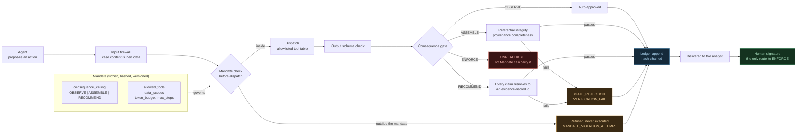
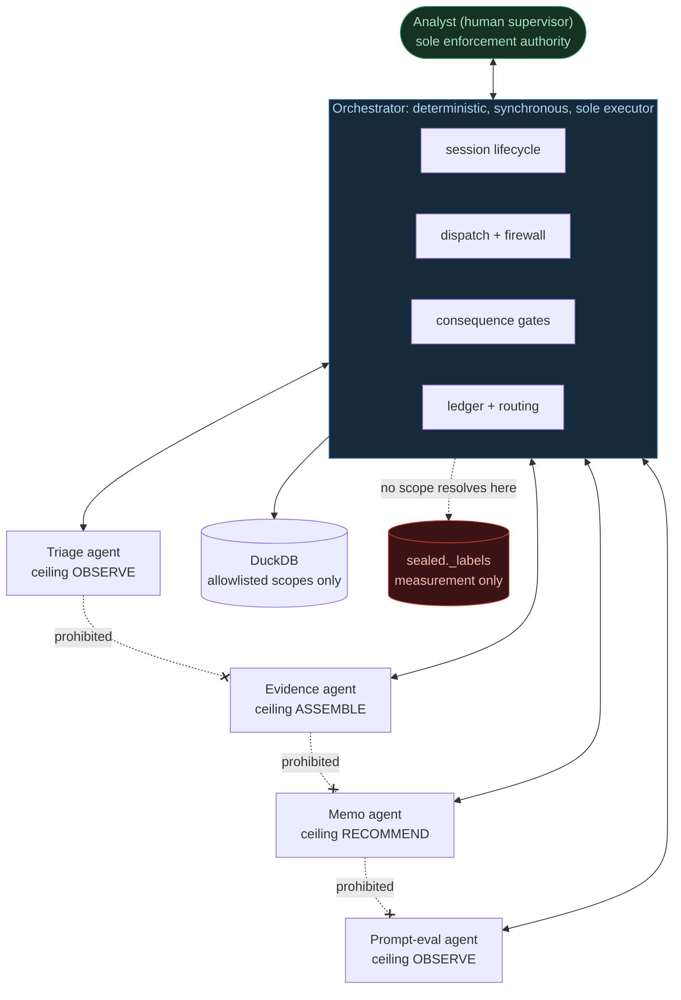
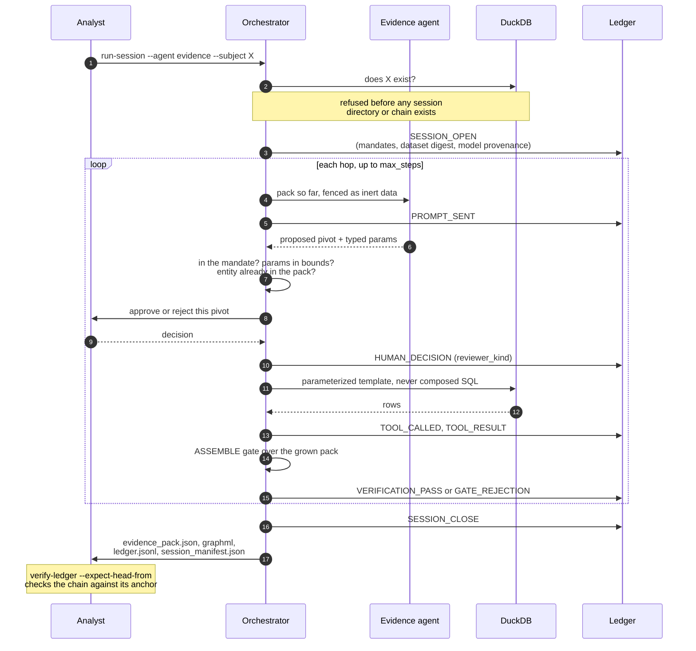

# Diagrams

Three views of the same system. Rendered natively by GitHub; the source is
Mermaid so the diagrams live in version control rather than in an image nobody
can edit.

## 1. The governance spine

The path every agent output takes, and the one path it cannot take. Read left to
right: an agent proposes, deterministic code disposes, a human governs.

`ENFORCE` is drawn as a terminal box with no inbound edge from the gate on
purpose. It is not blocked at runtime; it is unreachable at type level, because
`Consequence.ENFORCE` is excluded from the `AgentConsequence` alias every
`Mandate` is built from. The claim this diagram makes is narrow and exact: **no
agent action can reach the ENFORCE gate.** It is not that the enum member cannot
be named.

## 2. The fleet under the orchestrator

The prohibited topology matters more than the permitted one. There is no edge
between any two agents, and that absence is enforced by an import-graph test,
not by convention.

Halting the orchestrator halts the fleet, because it is the only thing that
executes anything. There is no background autonomy to chase down.

## 3. Session dataflow

One evidence session, end to end. This is what the artifacts in
[`examples/02-evidence-t02-ring`](../examples/02-evidence-t02-ring/) record.

The agent never touches the database and never writes SQL. It names a template
and supplies typed parameters; the orchestrator runs it. Any entity id the agent
supplies must already be in the pack, so an investigation expands outward from
the analyst's chosen seed rather than reaching anywhere it likes.
