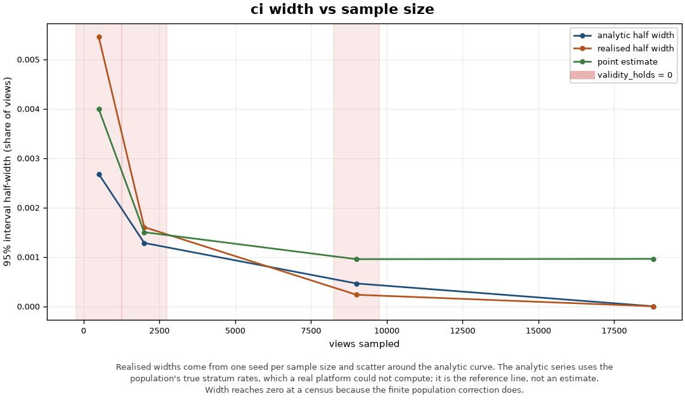
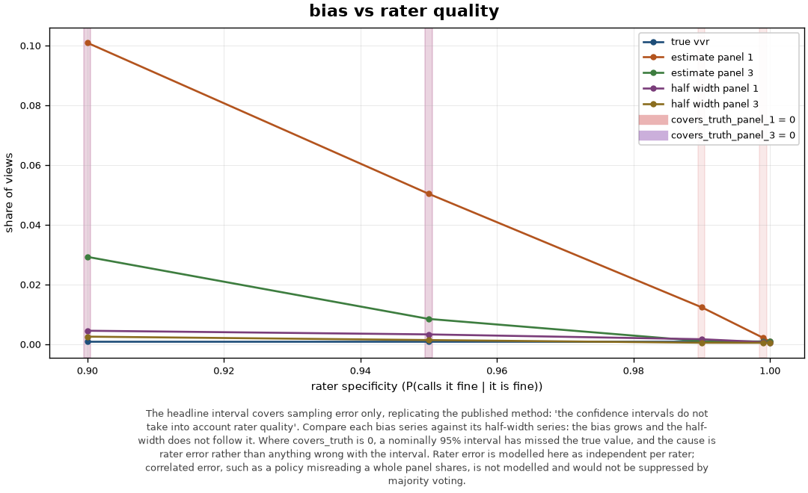
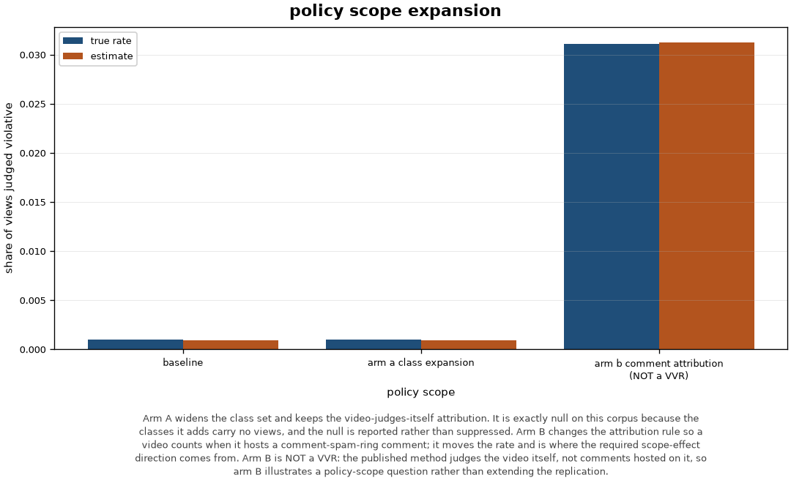

# Trust & Safety Sentry: measurement report

Session `session-2d3ca01015f8`.

| stamp | value |
|---|---|
| generated (IST) | `2026-08-01T21:07:45.213459+05:30` |
| code (git SHA) | `63565420eb8c48f0c106465e123ac7d10c2b00a9` |
| measurement seed | `42` |
| dataset digest | `060c60d71ac4acf67046f49e7fb581160937355ce1f88c3a2b3d118f48860e1d` |
| dataset seed / scale | `42 / 1` |
| policy corpus | `1.0.0 (9dd656fb9fd9)` |
| active prompt versions | `classify.threat_class=71610d32c1e6, evidence.pivot=f67159a912aa, memo.statement=ff0bce78a2dd, triage.rationale=459d5860b7fe` |

## Platform lens: Violative View Rate

**0.0953%** (95% CI 0.0720% to 0.1186%), n=9000 of N=18780.

The interval covers sampling error only, replicating the published method's
statement that its confidence intervals do not take into account rater quality.

```
VVR: 0.0953%  95% CI [0.0720%, 0.1186%]
scope=baseline  allocation=optimal  n=9000 of N=18780

stratum                  N_h    n_h  calls        p_h
-----------------------------------------------------
lowest_risk             9157   1532      0    0.0000%
middle_risk             9526   7452     14    0.1879%
no_score_available        97     16      0    0.0000%

normal approximation validity:
  ok   every sampled stratum has n_h >= 2
  FAIL expected violative calls 8.58 >= 10
  ok   expected non-violative calls 8991.42 >= 10
  ok   interval lies inside [0, 1] without clipping
  FAIL no under-sampled stratum returned an all-or-nothing rate: lowest_risk, no_score_available

panel disagreement rate: 0.00%
interval covers sampling error only; rater quality is not in it
```

Bootstrap cross-check: 0.0476% to 0.1497% over 2000 replicates, half-width ratio 2.194 against an expected 2.143. The bootstrap ignores the finite population correction, so it is expected to be the wider of the two.

Strata and the measured gradient:

```
stratum                  N_h    share   true p_h
------------------------------------------------
lowest_risk             9157    48.8%    0.0000%
low_risk                   0     0.0%    0.0000%
middle_risk             9526    50.7%    0.1890%
highest_risk               0     0.0%    0.0000%
no_score_available        97     0.5%    0.0000%
------------------------------------------------
total                  18780   100.0%    0.0958%
```

Policy-scope arms:

| scope | rate | is a VVR |
|---|---|---|
| arm_a_class_expansion | 0.0889% | yes |
| arm_b_comment_attribution | 3.1224% | **NO, attribution differs** |

## Workflow lens

### Governance activity

```
Governance activity (MEASURED, counted from session events)
------------------------------------------------------------------
  gate rejections                0
  mandate violation attempts     0
  prompt injection signals       0
  pivots refused before review   0
  verification passes            2
  verification failures          0
  human decisions recorded       0
  memo/output verification pass rate: 100.0%

  NOTE: no control above fired. Every rejection, violation attempt,
  injection signal, refused pivot and verification failure is zero.
  That is not evidence the governance layer works: it means nothing in
  this session exercised a gate, a mandate ceiling, the firewall or the
  verifier, so this session supports no claim about any of them.
  Passing verifications and recorded human decisions are counted above
  and are not controls firing; they are the ordinary path.
```

### Analyst minutes (MODELLED, not measured)

```
Analyst minutes: a MODELLED comparison over stated assumptions
==================================================================

No published per-case review-time benchmark exists to compare these figures against. TSPA, which defines the metric, notes that review time 'may include time waiting in queues or going through automatic processes, or only the time when the reviewer is actively working on a specific review', and warns that 'there is considerable industry variation in both precise definitions and naming conventions'. Every minute figure below is a stated assumption, not a measurement, and the delta is a property of the assumption table.

Assumptions (every figure below is assumed, none is measured)
------------------------------------------------------------------
step                                baseline  assisted    delta
triage and case selection                4.0       1.0      3.0
evidence gathering                      25.0       8.0     17.0
memo drafting                           20.0       7.0     13.0
citation and policy verification         8.0       3.0      5.0
human decision and sign-off              3.0       3.0      0.0
------------------------------------------------------------------
per case                                60.0      22.0     38.0

Over 1 case(s), the assumption table implies a difference of 38.0 minutes
between the two arms. That figure is a property of the table above and carries no
evidence that either arm would occur in practice.

One-way sensitivity (+/-50% on each assumed assisted time, alone)
------------------------------------------------------------------
step                                delta low  delta high  break-even
triage and case selection                37.5        38.5         4.0
evidence gathering                       34.0        42.0        25.0
memo drafting                            34.5        41.5        20.0
citation and policy verification         36.5        39.5         8.0
human decision and sign-off              36.5        39.5         3.0
------------------------------------------------------------------
The modelled difference is most sensitive to 'evidence gathering', which moves it by 8.0 minutes on its own.

'break-even' is the assisted minutes at which that step contributes nothing to the
difference. Read it as the threshold an assumption would have to cross before the
sign of the comparison changed. None of these thresholds has been measured.
```

## Figures





## Honest limits

1. The baseline VVR estimand is narrow by construction and narrower still on this corpus. A view counts as violative only when the viewed video's own label is a non-benign, non-spam class, which is what the published method judges. On the seed-42 build that is 18 views out of 18,780, all of them from T-02 and T-07; T-04 receives no view events at all.
2. The 95% interval covers sampling error only. This replicates the published method, which states that its confidence intervals do not take into account rater quality. Rater error is modelled separately and reported as a bias curve, and at realistic rater accuracy that bias is larger than the interval.
3. The normal approximation is invalid at every realistic sample size on this corpus and becomes valid only at a full census. Every estimate reports the failed condition rather than suppressing it.
4. Only two of the five risk strata hold any views, because viewed videos take just two distinct observable profiles. No choice of band cut points can populate the others.
5. The risk proxy is an analog of the published method's classifier-score stratification, built from content-provenance features. It is not a detector, has no measured precision or recall, and must not be read as a detection result.
6. Rater error is modelled as independent per rater. Correlated error, such as a policy misreading a whole panel shares, is not modelled and would not be suppressed by majority voting.
7. No published per-case review-time benchmark exists. Every figure in the analyst-minutes section is a stated assumption, and the section reports a sensitivity range rather than a result.
8. Evidence recovery plateaus. The metadata-pivot strategy recovers the shared-registration-linked core and provably cannot reach ring members connected only by looser signals: on t02_chan_000_000 it reaches 4 of 8 members and the budget curve is flat from 5 pivots onward. That is a bounded limit of a metadata-pivot strategy rather than a defect, and it is the same shape as the structural recovery ceiling already reported per threat class.
9. The generator's planted threat volume is fixed and does not vary with scale, so every rate above is bounded by the corpus rather than by the method. This bound comes from the data and no parameter can move it.
10. Figures are byte-identical across two renders in one environment only. Cross-version stability is not claimed. The reproducibility artifact is the curve data in JSON and CSV.
